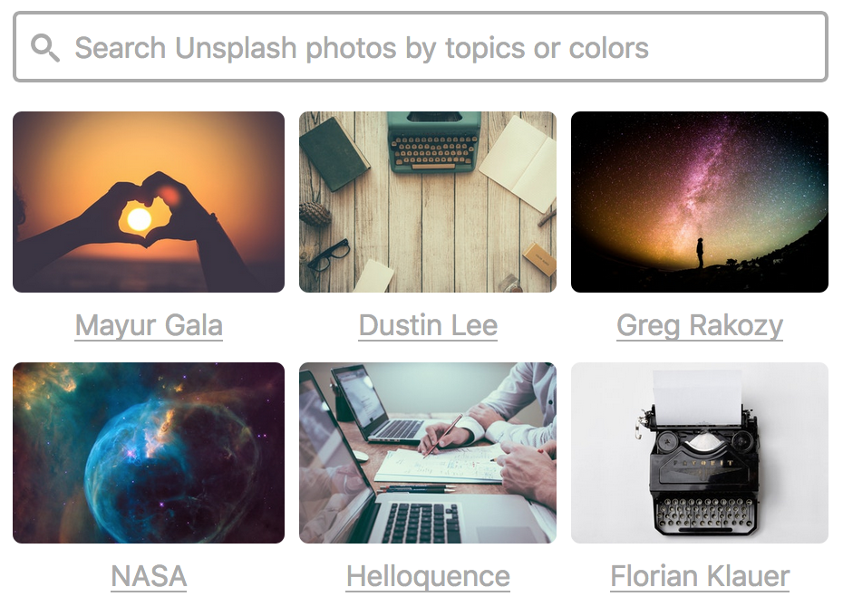

# unsplash-react

React components to get unsplash images in your app!



## Install

```sh
$ yarn add unsplash-react
```

## Usage

Here's the most basic example:

```jsx
import UnsplashReact, { Base64Uploader, withDefaultProps } from "unsplash-react"

const MY_ACCESS_KEY = "UNSPLASH_KEY_FROM_UNSPLASH"

export default function UnsplashUploader() {
  return (
    <UnsplashReact
      accessKey={MY_ACCESS_KEY}
      Uploader={withDefaultProps(Base64Uploader, { name: "event[logo]" })}
    />
  )
}
```

`unsplash-react` has two core steps

1. Find a photo from unsplash
2. Download the photo into the user's browser

Once the photo blob is in the browser, you can insert it into a page (using the URL), or upload the photo to your server for further use.

This is accomplished through the `Uploader` prop, which is a React component that is initialized with a standard set of props, and uses callbacks to signal its progress.

Please see the <a href="examples">examples</a> directory for more information, and don't hesitate to <a href="issues">open an issue</a> if you need help.

### Try it out locally!

You'll need to [create an application with Unsplash](https://unsplash.com/developers) and get an access key to demo the components.

Once you have the access key, follow these steps.

```sh
$ git clone https://github.com/danielma/react-unsplash
$ cd react-unsplash
$ yarn
$ UNSPLASH_ACCESS_KEY=key yarn run dev
$ open http://localhost:10001/
```

## `<UnsplashReact />` Props

name                  | type                       | required | default   | description
--------------------- | -------------------------- | -------- | --------- | -----------
`accessKey`           | `string`                   | yes      | n/a       | Access key from the [Unsplash developer site](https://unsplash.com/oauth/applications)
`applicationName`     | `string`                   | yes      | n/a       | Application name for [UTM tracking](https://medium.com/unsplash/unsplash-api-guidelines-28e0216e6daa)
`columns`             | `number`                   | no       | 3         | Number of columns to show in search results
`defaultSearch`       | `string`                   | no       | `""`      | A default search string. If not set, `react-unsplash` will show popular photos from Unsplash
`highlightColor`      | `string`                   | no       | `#00adf0` | The highlight color for images when they have been selected and downloaded
`onFinishedUploading` | `func`                     | no       | no-op     | A callback, for when the photo has finished uploading. Called with the download response from the uploader (eg, the `response` with the `blob()`)
`onSelectPhoto`       | `func`                     | no       | no-op     | A callback, for when a photo is clicked. Called with the photo data from the Unsplash API
`photoRatio`          | `number`                   | no       | `3 / 2`   | The `width/height` ratio for displaying search results
`preferredSize`       | `shape({ width, height })` | no       | n/a       | Your application's preferred width and height for downloaded images. If not set, `react-unsplash` will download full size images
`Uploader`            | Component                  | no       | `Base64Uploader` | The component used to upload photos from Unsplash to your application.

## `<Uploader />` Props

name | type | required | default | description
--- | --- | --- | --- | ----
`unsplashPhoto` | Unsplash API object | yes | n/a | The photo object from the Unsplash API
`downloadPhoto` | `(UnsplashPhoto) => Promise<Response>` | yes | n/a | Downloads the photo from Unsplash. If `preferredSize` is set, the returned `Response` is a request to download the preferred size. Otherwise, it is a request to download the full size image
`onFinishedUploading` | `func` | yes | n/a | This function must be called when the Uploader has finished uploading the photo.

## Built-in Uploaders

There are examples of the 3 main uploaders in the <a href="examples">examples</a> directory.

### `BlobUploader`

The `BlobUploader` downloads the selected unsplash photo, and calls `onBloblLoaded` with a `Promise<Blob>` representing the downloaded image.

### `Base64Uploader`

The `Base64Uploader` downloads the selected unsplash photo as a blob, encodes it as base64, and inserts a `<input type="hidden" />` with the encoded value for you to upload to your server.

### `DataTransferUploader` (experimental)

The `DataTransferUploader` uses experimental APIs only available (as of writing) in Chrome to download the photo as a blob and set it as the value of a `<input type="file" />` for uploading to your server.

### `ExternalLocationUploader`

The `ExternalLocationUploader` downloads the selected unsplash photo, and then executes a `POST` request to `uploadUrl`. It then calls `this.props.onFinishedUploading` with the `Promise<Response>` of that request.

The key example usage for this is direct to S3 upload. You can provide and `uploadUrl`, and after the photo is uploaded, you can save the bucket URL on your server.

### `InsertIntoApplicationUploader`

The `InsertIntoApplicationUploader` calls `onFinishedUploading` with the URL of the photo to download. This can be used to insert the photo directly into your application.

## Contributions welcome! :smile:
